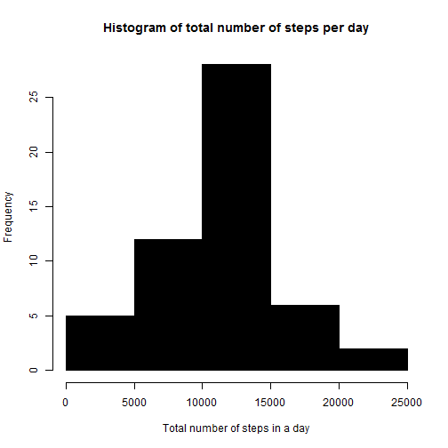
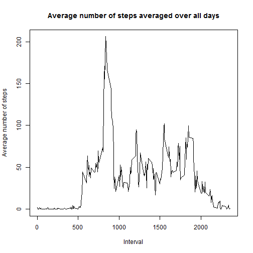
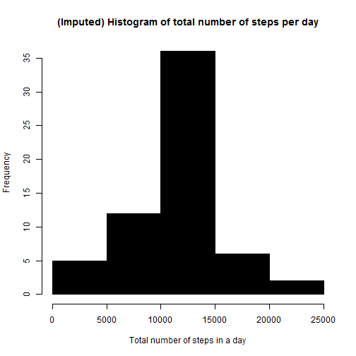
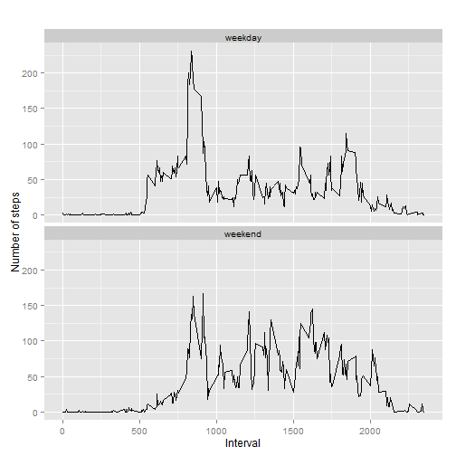

---

title: "Reproducible Research: Peer Assessment 1"

output: 
  
	html_document:
    
		keep_md: true

---


# Reproducible Research: Peer Assessment 1

## Loading and preprocessing the data

```r
df <- read.csv('activity.csv', as.is=TRUE) 
df2 <- na.omit(df) 
```

## What is mean total number of steps taken per day?

```r
table_date_steps <- aggregate(steps ~ date, df2, sum)
hist(table_date_steps$steps, col=1, main="Histogram of total number of steps per day", xlab="Total number of steps in a day")
```

 

```r
mean(table_date_steps$steps)
```

```
## [1] 10766.19
```

```r
median(table_date_steps$steps)
```

```
## [1] 10765
```
The mean and median total number of steps per day are 10766 and 10765 steps respectively.

## What is the average daily activity pattern?

```r
table_interval_steps <- aggregate(steps ~ interval, df2, mean)
plot(table_interval_steps$interval, table_interval_steps$steps, type='l', col=1, 
	main="Average number of steps averaged over all days", xlab="Interval", ylab="Average number of steps")
```

 

```r
max_ave_steps_row_id <- which.max(table_interval_steps$steps)
table_interval_steps [max_ave_steps_row_id, ]
```

```
##     interval    steps
## 104      835 206.1698
```

## Imputing missing values

```r
df_NA <- df[!complete.cases(df),]
nrow(df_NA)
```

```
## [1] 2304
```

```r
for (i in 1:nrow(df)){
  if (is.na(df$steps[i])){
    interval_val <- df$interval[i]
    row_id <- which(table_interval_steps$interval == interval_val)
    steps_val <- table_interval_steps$steps[row_id]
    df$steps[i] <- steps_val
  }
}
table_date_steps_imputed <- aggregate(steps ~ date, df, sum)
hist(table_date_steps_imputed$steps, col=1, main="(Imputed) Histogram of total number of steps per day", 
	xlab="Total number of steps in a day")
```

 

```r
mean(table_date_steps_imputed$steps)
```

```
## [1] 10766.19
```

```r
median(table_date_steps_imputed$steps)
```

```
## [1] 10766.19
```

```r
mean(table_date_steps$steps)
```

```
## [1] 10766.19
```

```r
median(table_date_steps$steps)
```

```
## [1] 10765
```

## Are there differences in activity patterns between weekdays and weekends?


```r
df$date <- as.Date(df$date, "%Y-%m-%d")
df$day <- weekdays(df$date)
df$day_type <- c("weekday")
for (i in 1:nrow(df)){
  if (df$day[i] == "Saturday" || df$day[i] == "Sunday"){
    df$day_type[i] <- "weekend"
  }
}
df$day_type <- as.factor(df$day_type)
table_interval_steps_imputed <- aggregate(steps ~ interval+day_type, df, mean)
library(ggplot2)
qplot(interval, steps, data=table_interval_steps_imputed, geom=c("line"), xlab="Interval", 
	ylab="Number of steps", main="") + facet_wrap(~ day_type, ncol=1)
```

 
